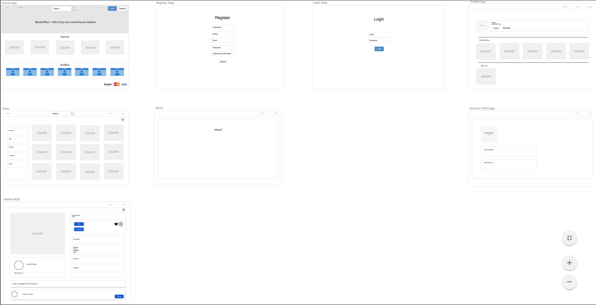
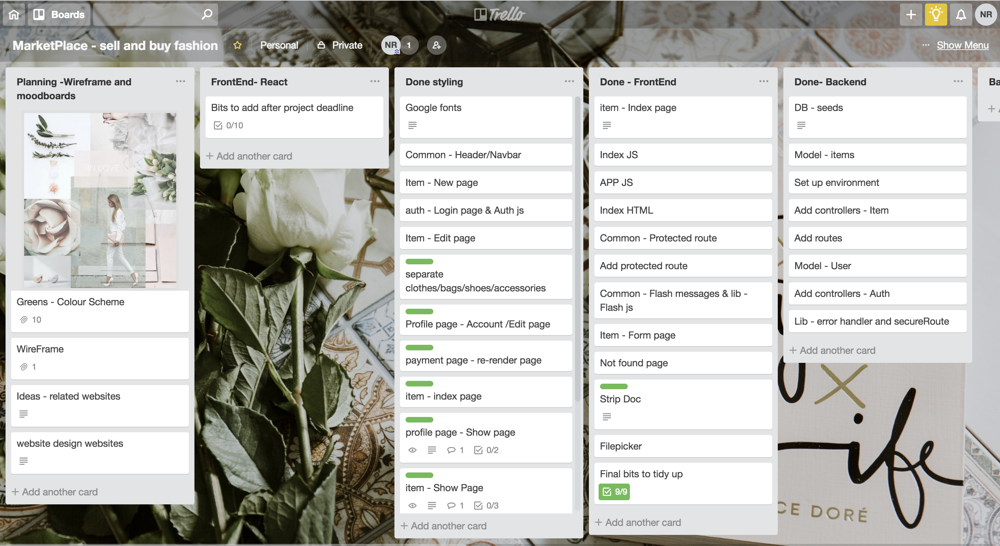
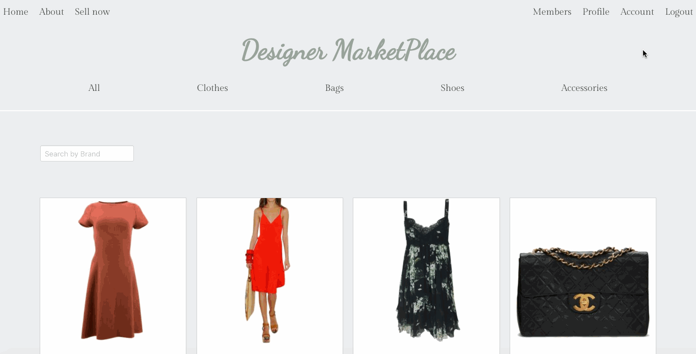
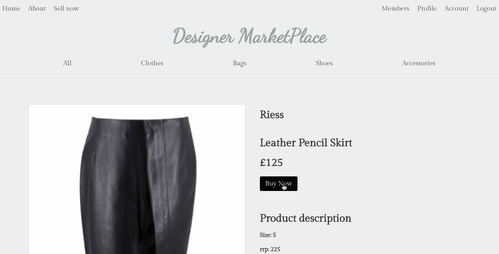
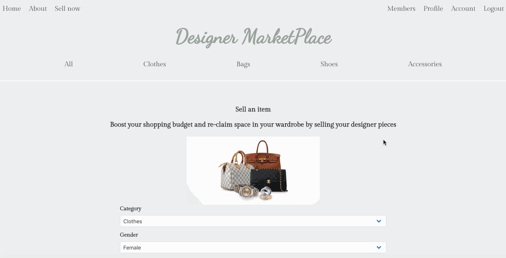
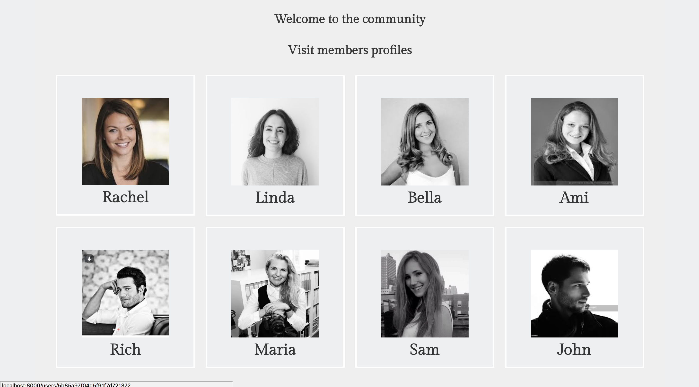

# GA WDI-34  Project #4: A MERN stack Application

## Designer Marketplace
Visit app which is deployed on [Heroku](https://designer-marketplace.herokuapp.com/)

### Project Brief
* **Build a full-stack application** by making your own backend and your own front-end
* **Use an Express API** to serve your data from a Mongo database
* **Consume your API with a separate front-end** built with React
* **Be a complete product** which most likely means multiple relationships and CRUD functionality for at least a couple of models
* **Implement thoughtful user stories/wireframes** that are significant enough to help you know which features are core MVP and which you can cut
* **Have a visually impressive design**
* **Be deployed online** so it's publicly accessible.
* **Have automated tests** for _at least_ one RESTful resource on the back-end, and _at least_ one classical and one functional component on the front-end.
---
#### Technologies Used
HTML | SCSS | JavaScript (ES6) | MongoDB | Express | React | Node.js | Webpack | Mongoose | [Draw.io](https://www.draw.io) | [Trello](https://trello.com)

<hr/>

#### Idea
For the final WDI project, I opted to complete this project solo to gain experience in developing the full process of building a MERN stack app using the latest technology we learnt.

I choose to build a resale e-commerce application which allows the public to sell and buy unwanted luxury clothes, bags, shoes and accessories. I got my inspiration from sites such as Vestiaire Collective, HEWI and Vinted.

<strong>Homepage</strong>: The homepage invites new users to the website and provides a taster of what Designer Marketplace has to offer for sale.
<p align="center"></p>

#### Planning and Design
I used Draw.io to plan a skeleton of the website identifying the functionality and design and managed this project using Trello to organise and prioritise tasks.

<strong>Wireframes - Draw.io</strong>:
<p align="center"></p>

<strong>Planning - Trello</strong>:
<p align="center"></p>

#### The build
I have successfully built a fully functioning full-stack application with a back-end and front-end that has a RESTful design pattern.

<strong>Items Index Page</strong>: This page is to showcase all the items for sale. I have included a filter by category and a search by brand option.
<p align="center"></p>

CODE: Below I have included the code used to filter items on the page and return by the brand name. Here I used Regular Expression, i.e. regex to match patterns of the character with strings.

```
filteredItems = (items) => {
  const re = new RegExp(this.state.search, 'i');
  return items.filter(item => re.test(item.designerName));
}
```
<strong>Items Show Page</strong>: The show page for items allows the buyer to browse the product detail. On this page I have developed a comment function which allows users to leave a message about the product.
<p align="center"></p>

<strong>Buy Now</strong>: A significant part of the project was to implement a payment process which allows payments from buyers. I successfully implemented Stripe charges where the app processes payment by generating a token. The Stripe API is in test mode therefore only a test card information will make successful payments.
<p align="center"></p>

CODE:
I used Stripe Elements with React to build the payment flow to collect data from the user and create a token.
```
submit = (e) => {
  e.preventDefault();
  this.props.stripe.createToken({ name: 'Name' })
    .then(token => {
      axios({
        url: '/api/orders',
        method: 'POST',
        headers: {Authorization: `Bearer ${Auth.getToken()}`},
        data: {
          ...token,
          currency: 'GBP',
          amount: this.props.amount * 100,
          payee: User.getCurrentUser().username || '',
          UserEmail: User.getCurrentUser().email || ''
        }
      })
        .then(() => this.setState({ complete: true }));
    });
}
```
Implementing the Stripe card API took a significant amount of time to complete. The documents and instructions I followed were intuitive although as we learnt a different approach, such as making AXIOS request rather than Fetch, this means I had to watch tutorials and read a lot of documentation before implementing this API.

<strong>Add a new item</strong>: This application has CRUD functionality where you can create, read, update and delete items for sale. For this feature, I have implemented API Filestack to enable users to upload images. I have also included drop-down options to make it easier for users to select options when filling out the form.
<p align="center"></p>

<strong>Users Profile Index Page</strong>: I have created a users profile index page to provide the app a community feel. Allowing users to view profiles for buyers and sellers.
<p align="center"></p>

#### Challenges and features to include
- Disable buy now button when an item has been sold
- Payment successful to include order info including order id, and buyer info, i.e. email and address.
- filter options to include sort by colour, item or price.
- Favourite items and list on the user profile page (i.e. wishlist)
- Allow users to follow each other
- Implement Apple pay, Google pay and PayPal
